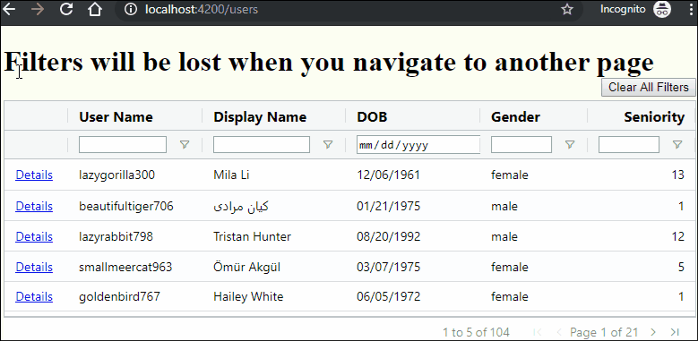
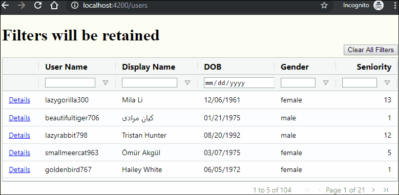

# Retaining Filters in ag-Grid

## [Demo](https://changhuixu.github.io/retaining-filters-in-ag-grid/)

## [Medium Blog Post](https://medium.com/javascript-in-plain-english/retaining-ag-grid-filters-using-query-parameters-55167be07a20)

The ag-Grid library provides the best grid functionalities in the world. One of its useful features is column filtering.

A common user story is like the following. A user filters the data grid and chooses one row to view the details page. When the user wants to navigate back to the grid page, the filters are gone. The user has to filter the data grid again to obtain previous filtered data rows. How to retain the previous filters?

The ag-Grid has several built-in filters, including TextFilter, NumberFilter, and DateFilter. We can also use combined column filters to filter results. A combined filter is consist of two filters joined by a boolean operation (AND, OR) between them.

In this blog post, we will implement an easy way to retain ag-Grid filters using route query parameters in Angular.

## By default, filters will be lost when navigating to another page

## Filters are retained using route query parameters

